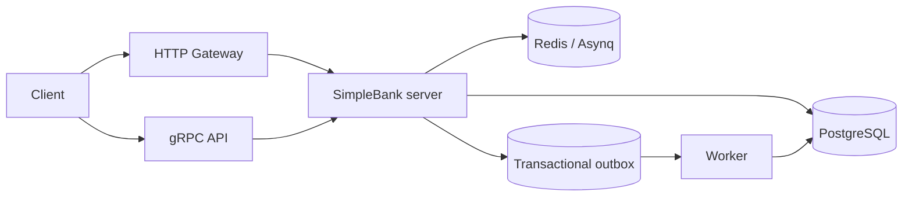

# SimpleBank

SimpleBank is a small banking backend built with Go, PostgreSQL, Redis, gRPC, and a gin-based HTTP gateway.
It supports user creation and login, account management, money transfers, token renewal, and an outbox-driven async worker for post-create user tasks.

## Highlights

- HTTP + gRPC API surface from one proto contract
- PostgreSQL-backed transactions for accounts, transfers, sessions, and users
- Transactional outbox for reliable async work
- Access + refresh token auth with purpose-aware validation
- Swagger/OpenAPI docs under `/swagger/`
- GitHub Actions CI for vet, lint, tests, race, vuln scan, secret scan, and Docker build

## Architecture



## Quick start

1. Copy the example env file:

   ```bash
   cp app.env.example app.env
   ```

2. Start the stack:

   ```bash
   make up
   ```

3. Open the services:

   - HTTP gateway: `http://localhost:8080`
   - gRPC: `localhost:9090`
   - Swagger UI: `http://localhost:8080/swagger/`

The app container runs migrations on startup. If you run the app natively with `go run .`, keep `app.env` in the repo root and make sure PostgreSQL and Redis are available.

## Useful commands

| Command | What it does |
| --- | --- |
| `make migrateup` | Apply database migrations |
| `make test` | Run the full test suite |
| `make test-race` | Run tests with the race detector |
| `make check` | Run vet, lint, tests, and vuln checks |
| `make gitleaks` | Scan the repository history for secrets |
| `make docker-build` | Build the release container image locally |
| `make ci` | Run the local CI bundle |
| `make proto` | Regenerate protobuf, gRPC gateway, and Swagger artifacts |
| `make sqlc` | Regenerate SQLC queries and models |
| `make mock` | Regenerate GoMock store stubs |

## Configuration

The app reads configuration from `app.env` or environment variables.

Important values:

- `DB_SOURCE`
- `MIGRATION_URL`
- `REDIS_ADDRESS`
- `HTTP_SERVER_ADDRESS`
- `GRPC_SERVER_ADDRESS`
- `TOKEN_SYMMETRIC_KEY` (must be exactly 32 characters)
- `ACCESS_TOKEN_DURATION`
- `REFRESH_TOKEN_DURATION`

See `app.env.example` for a complete local-dev template.

## API surface

Main RPCs and gateway routes:

- `CreateUser` → `POST /v1/create_user`
- `UpdateUser` → `PATCH /v1/update_user`
- `LoginUser` → `POST /v1/login_user`
- `RenewAccessToken` → `POST /v1/users/renew_access`
- `CreateAccount` → `POST /v1/accounts`
- `GetAccount` → `GET /v1/accounts/{id}`
- `ListAccounts` → `GET /v1/accounts`
- `CreateTransfer` → `POST /v1/transfers`

## Security notes

- Access and refresh tokens are purpose-separated and validated accordingly.
- Legacy tokens are rejected during the auth cutover; see [docs/security/token-cutover.md](docs/security/token-cutover.md).
- Git history is scanned for secrets in CI.

## Contributing

If you change protobuf or SQLC inputs, regenerate the derived files and run:

```bash
make check
make ci
```
